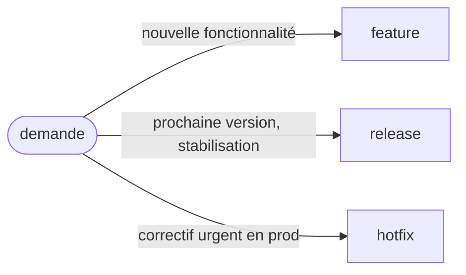

# Git Flow

> Suppose que le modèle est déjà en place sur ce repo (branches `main`/`develop` existantes) — voir
> [`../../rules/git-flow.md`](../../rules/git-flow.md) pour la description complète du modèle avant
> de l'adopter sur un projet qui ne l'a pas encore. Vérifier avec l'utilisateur si un doute existe
> sur la présence réelle de `develop` plutôt que de le supposer.

## Actions

| Type | Action | Part de | Fusionne dans |
|---|---|---|---|
| Feature | [`feature`](actions/feature.md) | `develop` | `develop` |
| Release | [`release`](actions/release.md) | `develop` | `main` **et** `develop` |
| Hotfix | [`hotfix`](actions/hotfix.md) | `main` | `main` **et** `develop` |

Chaque fichier d'action couvre le démarrage (créer la branche) et la fin (fusion, éventuel tag) de
son type — lire seulement le fichier concerné, pas les trois d'un coup.

## Règles transversales

- **Jamais de fusion directe `feature/* → main`.** Toujours via `develop`.
- **`release/*` et `hotfix/*` fusionnent dans `main` ET `develop`, jamais un seul des deux** —
  l'oubli du retour vers `develop` est l'erreur la plus fréquente de ce modèle (voir
  [`rules/git-flow.md`](../../rules/git-flow.md) > "Erreurs fréquentes"). Toujours rappeler
  explicitement les deux fusions à l'étape finish d'une release/d'un hotfix, jamais en supposer une
  faite implicitement par l'autre.
- **Créer une branche locale reste une action réversible** (pas de push, pas de commit
  d'autrui affecté) — les actions `*-start` peuvent l'exécuter directement quand l'utilisateur le
  demande. **Pousser, ouvrir une PR, fusionner, taguer restent soumis à la règle générale** : pas
  d'exécution sans demande explicite pour ce tour ([`rules/general-coding.md`](../../rules/general-coding.md)),
  et pour le tag spécifiquement, l'interdiction absolue du skill [`release`](../release/SKILL.md)
  s'applique (jamais tagué/poussé par Claude lui-même, même sur "go" explicite).
- Avant de démarrer une branche, vérifier l'état réel de sa branche de base (`git fetch` puis
  comparer, pas juste supposer qu'elle est à jour localement).
