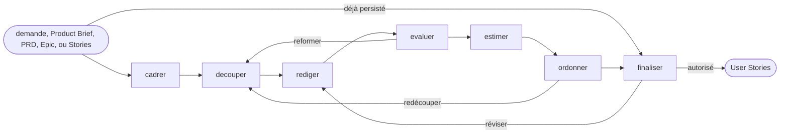

# User Stories

> Adapté de [`ai-driven-dev/framework`](https://github.com/ai-driven-dev/framework)
> (`plugins/aidd-pm/skills/02-user-stories`) — voir la note d'adaptation en bas de fichier pour ce
> qui a changé par rapport à la source.

## Actions

Suivre le flux ci-dessus. Ne lire que le fichier de l'action en cours, pas tout d'un coup.

| # | Action | Fait |
|---|---|---|
| 01 | [`cadrer`](actions/01-cadrer.md) | Résoudre la source et le périmètre de la Story |
| 02 | [`decouper`](actions/02-decouper.md) | Trouver les tranches verticales livrables |
| 03 | [`rediger`](actions/03-rediger.md) | Rédiger les Stories et leurs critères d'acceptation |
| 04 | [`evaluer`](actions/04-evaluer.md) | Déterminer la maturité et les blocages |
| 05 | [`estimer`](actions/05-estimer.md) | Estimer, seulement si applicable |
| 06 | [`ordonner`](actions/06-ordonner.md) | Ordonner, seulement si utile |
| 07 | [`finaliser`](actions/07-finaliser.md) | Approuver, persister, ou transitionner |

## Règles transversales

- Les décisions produit restent à l'utilisateur — ne jamais les trancher seul.
- Séparer clairement preuve (ce qui vient de la source), décision (ce qui a été validé), et
  hypothèse (ce qui reste à confirmer).
- Préserver les liens vers la source et les éditions déjà faites — ne pas écraser une Story
  existante sans raison.
- Poser des questions naturelles ; ne jamais exposer le nom des actions internes ou l'état interne
  non pertinent pour l'utilisateur.
- Exiger une validation explicite (ou une autorité d'écriture bornée donnée par l'appelant) avant
  toute écriture sur disque.
- Ne rédiger une Story qu'une fois acteur, besoin et résultat explicites dans la source ou
  confirmés par l'utilisateur — pas de Story vague "pour avancer".

## Note d'adaptation

La version source s'appuie sur un système de mémoire projet (`aidd_docs/memory/`) propre à leur
framework — échelle d'estimation, méthode d'ordonnancement, Definition of Done, convention de
persistance. Ce repo n'a pas cet équivalent : chaque référence ci-dessous pointe vers le
`CLAUDE.md` du projet à la place, quand ces conventions existent, et se dégrade proprement (action
sautée, champ omis) sinon plutôt que d'inventer une convention.

La source fait aussi partie d'une suite `aidd-pm` complète (Epic, Task, Defect, Spike, PRD...) qui
propose ces autres types de ticket comme cible (voir [`handoffs`](references/handoffs.md)). Seul
`user-stories` est repris ici : les renvois vers ces autres skills sont remplacés par un simple
signalement à l'utilisateur ("ça ressemble plus à un Epic/une tâche technique/un défaut qu'à une
Story"), sans skill dédié vers lequel border pour l'instant.

Le chemin de persistance par défaut (`references/persistence.md`) est un choix arbitraire
(`docs/backlog/stories/<slug>.md`) cohérent avec [`../../rules/docs-structure.md`](../../rules/docs-structure.md)
sans y être imposé — ce rule ne prévoit pas de dossier `backlog/` par défaut, à n'ajouter que sur
besoin réel constaté (voir sa section sur l'ajout de dossiers). À adapter par projet si un tracker
externe (Jira...) fait déjà foi — dans ce cas ce skill sert surtout aux actions `cadrer` à
`finaliser` en mode session, sans persistance Markdown.
